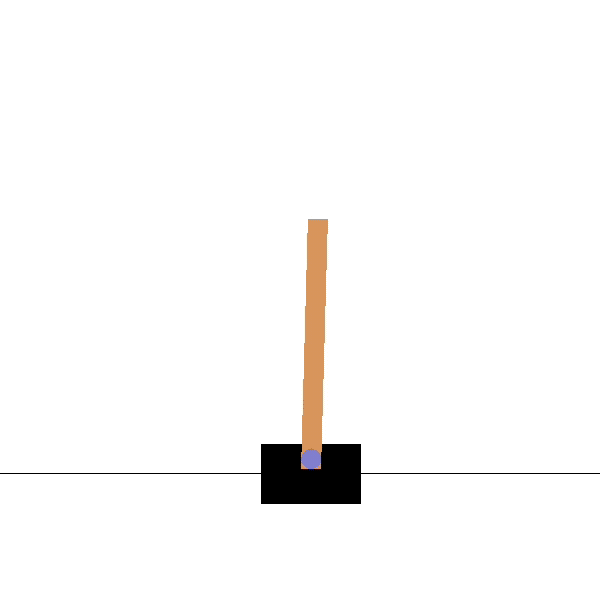
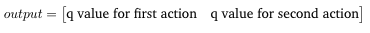

# DQN
This repository demonstrates how to implement a DQN reinforcement learning algorithm to play the CartPole game with TensorFlow 2.0.

## Cartpole
A pole is attached by an un-actuated joint to a cart, which moves along a frictionless track. The system is controlled by applying a force of +1 or -1 to the cart. The pendulum starts upright, and the goal is to prevent it from falling over. A reward of +1 is provided for every timestep that the pole remains upright. The episode ends when the pole is more than 15 degrees from vertical, or the cart moves more than 2.4 units from the center.

CartPole-v0 defines "solving" as getting average reward of 195.0 over 100 consecutive trials.

Check out corresponding Medium article: [Cartpole - Introduction to Reinforcement Learning (DQN - Deep Q-Learning)](https://towardsdatascience.com/cartpole-introduction-to-reinforcement-learning-ed0eb5b58288)


<div align=center>
    
</div>


## DQN

The main difference between DQN and Q-learning is we do not maintain a Q-table for each state and action. In DQN, we use a deep network to relace Q-table and the network can estimate the q-value for each state and action.

### Model:

```python
# learning rate = 0.0001, batch_size=20
model = Sequential()
model.add(Dense(24, input_shape=(obs_n,), activation="relu"))
model.add(Dense(24, activation="relu"))
model.add(Dense(act_n, activation="linear"))
model.compile(loss="mse", optimizer=Adam(learning_rate=learning_rate))
```

### Choose an action:

```python
def choose_action(self, S):
    if np.random.rand() <  self.epsilon:
        return random.randrange(self.act_n)
    q_value = self.model.predict(S)
    eturn np.argmax(q_value[0])
```

### Learn:
The network take a tuple (s, action, reward, S_prime, done) as input and the label is updated Q-values. If we call model.predict(), the output is :
<div align=center>
    
</div>

```python
def learn():
    for S, action, reward, S_prime, done in mini_batch:
        q_update = reward
        if not done:
            q_update = (reward + gamma * np.amax(model.predict(S_prime)[0]))
            q_values = model.predict(S)

            q_values[0][action] = q_update

        self.model.fit(S, q_values, verbose = 0)
```