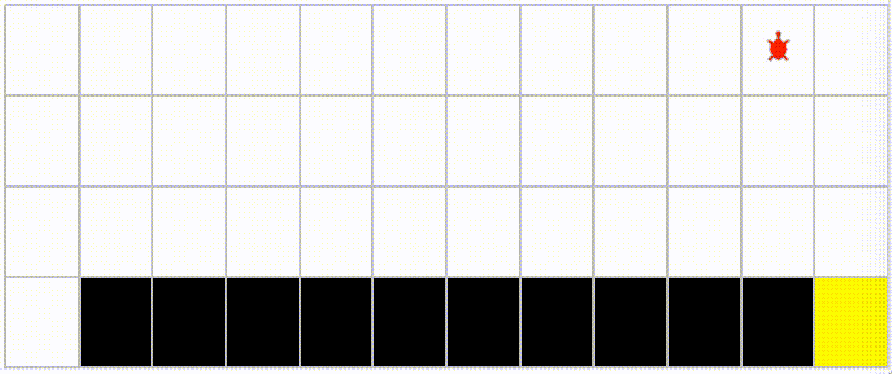

# Sarsa
This project apply sarsa algorithm on GYM clifwalking environment
## Agent Structure
An agent is constructed by:
* act_n: action dimension, 4 action in this example (up, down , left and right)
* learning_rate: learning rate
* e_greed: hyperparameter for epsilon-greedy strategy.
* gamma: discount factor
* 
* Q: Q -value table 
```python
def __init__(self, obs_n, act_n = 4, learning_rate=0.01, gamma=0.9, e_greed=0.1):
    self.lr = learning_rate
    self.gamma = gamma
    self.epsilon = e_greed
    self.act_n = act_n
    self.Q = np.zeros((obs_n, act_n))
```
## Select action
* predict()：input a state and output an action which has the maximum Q-value among all actions at that state
* sample()：input a state and outpu an action determine by epsilon-greedy strategy.

* epsilon-greedy strategy:
    - With epsilon probability, we perform a random action.
    - With 1 -  epsilon probability, we perform the action has the maximum Q-value.
        
```python

def predict(self, S):
        Q_values = self.Q[S]
        maxQ = np.max(self.Q[S])

        action = np.random.choice(np.where(Q_values == maxQ)[0])
        return action
        
def sample(self, S):
    if np.random.uniform(0, 1) < (1.0 - self.epsilon):
        action = self.predict(S)
    else:
        action = np.random.choice(self.act_n)

    return action


```

## Learn
Update the Q table by algorithm temporal difference:
<div align=center>
     
</div>

```python
 def learn(self, S, action, reward, S_prime, action_prime, done):
    predit_Q = self.Q[S, action]

    if (done):
        target_Q = reward
    else:
        target_Q = reward + self.gamma * self.Q[S_prime, action_prime]

    self.Q[S, action] += self.lr * (target_Q - predit_Q)
```

## Run episode
```python
def run_episode(env, agent, render = False):
    S = env.reset()
    action = agent.sample(S)

    while (True):
        S_prime, reward, done, _ = env.step(action)
        action_prime = agent.sample(S_prime)

        agent.learn(S, action, reward, S_prime, action_prime, done)

        action = action_prime
        S = S_prime

        if render:
            env.render()    # Show grid3
        if done:
            break
```

## Train
```python
for episode in range(2000):
    run_episode(env, agent, is_render)
```


